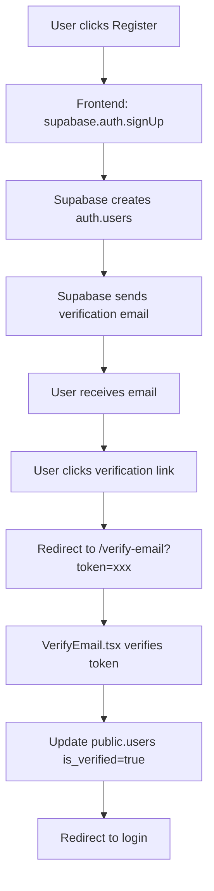

# Email Confirmation Setup Guide

Complete guide để setup email verification với Supabase Auth.

---

## ✅ IMPLEMENTED FEATURES

### Frontend
- ✅ **VerifyEmail.tsx** - Email verification page
  - Auto-verify từ email link
  - Manual verification check
  - Resend verification email
  - Beautiful UI với animations

### Backend
- ✅ Supabase Auth handles email sending
- ✅ OTP token verification
- ✅ Auto-update `is_verified` status

---

## 🔧 SUPABASE DASHBOARD SETUP

### Step 1: Enable Email Provider

1. **Navigate to:**
   - https://supabase.com/dashboard/project/okalizcwyzpwaffrkbey
   - Authentication → Providers → Email

2. **Settings:**
   ```
   ✓ Enable Email provider
   ✓ Confirm email (enable this)
   ✓ Secure email change
   ```

3. **Save** changes

---

### Step 2: Configure Email Auth Settings

1. **Authentication → Settings**

2. **Email Auth:**
   ```
   Confirm email: ON
   Double confirm email changes: ON  
   Enable email confirmations: ON
   ```

3. **Email Rate Limits:**
   ```
   Max frequency: 60 seconds (prevent spam)
   ```

---

### Step 3: Configure Site URL

1. **Authentication → URL Configuration**

2. **URLs:**
   ```
   Site URL: https://r4bbit-hub.vercel.app
   
   Additional Redirect URLs:
   - http://localhost:8080/verify-email
   - https://r4bbit-hub.vercel.app/verify-email
   - http://localhost:8080/auth/callback
   - https://r4bbit-hub.vercel.app/auth/callback
   ```

3. **Save**

---

### Step 4: Customize Email Templates (Optional)

1. **Authentication → Email Templates**

2. **Confirm Signup Template:**

```html
<h2>Confirm your signup</h2>

<p>Follow this link to confirm your account:</p>
<p><a href="{{ .ConfirmationURL }}">Confirm your email</a></p>

<p>Or copy and paste this URL into your browser:</p>
<p>{{ .ConfirmationURL }}</p>
```

**Variables Available:**
- `{{ .ConfirmationURL }}` - Verification link
- `{{ .Token }}` - OTP token
- `{{ .Email }}` - User email
- `{{ .SiteURL }}` - Site URL

3. **Customize:**
   - Subject: "Verify your R4bbit account"
   - Add R4bbit branding
   - Add logo/styling

---

## 📧 EMAIL FLOW

### Registration Flow



### Email Content

**Subject:** Confirm your signup

**Body:**
```
Hi there,

Thanks for signing up to R4bbit!

Please verify your email address by clicking the link below:

[Verify Email]

This link will expire in 24 hours.

---
R4bbit Team
```

---

## 🧪 TESTING

### Test Registration + Email Verification

1. **Register new account:**
   ```
   Email: test@yourdomain.com
   Username: testuser
   Password: Test123456
   ```

2. **Check inbox:**
   - Verification email should arrive within 1 minute
   - Check spam folder if not found

3. **Click verification link:**
   - Should redirect to `/verify-email?token=xxx`
   - Page shows "Verifying..."
   - Then "Email Verified!"
   - Auto-redirect to login

4. **Verify in database:**
   ```sql
   SELECT * FROM auth.users WHERE email = 'test@yourdomain.com';
   -- email_confirmed_at should be set
   
   SELECT * FROM public.users WHERE email = 'test@yourdomain.com';
   -- is_verified should be true
   ```

---

### Test Resend Email

1. **Navigate to `/verify-email` without token**

2. **Click "Resend Verification Email"**

3. **Email sent again** (rate limited to 60s)

4. **Check inbox** for new email

---

## 🐛 TROUBLESHOOTING

### Email Not Received

**Check:**
1. Spam/Junk folder
2. Email provider settings in Supabase
3. Supabase logs: Dashboard → Logs → Auth Logs

**Fix:**
- Verify SMTP settings
- Check rate limits (1 email per 60s)
- Ensure email provider not blocking Supabase

---

### Verification Link Expired

**Error:** "Token expired or invalid"

**Solution:**
1. Click "Resend Verification Email"
2. Use new link (24h expiry)

---

### "Email already confirmed"

**Cause:** User already verified

**Solution:**
- User can login directly
- Redirect to /auth

---

### is_verified not updating

**Check:**
```sql
SELECT * FROM public.users WHERE email = 'user@email.com';
```

**Fix in VerifyEmail.tsx:**
```typescript
// After successful verification
await supabase
  .from('users')
  .update({ is_verified: true })
  .eq('id', data.user.id);
```

---

## 📊 MONITORING

### Supabase Dashboard

**Auth Logs:**
- Dashboard → Logs → Auth Logs
- Filter: `user_signedup`, `user_confirmed`

**Metrics:**
- Total signups
- Confirmed vs unconfirmed users
- Email delivery rate

### SQL Queries

```sql
-- Unverified users
SELECT email, created_at 
FROM auth.users 
WHERE email_confirmed_at IS NULL
ORDER BY created_at DESC;

-- Verification rate
SELECT 
  COUNT(*) as total,
  COUNT(email_confirmed_at) as verified,
  ROUND(COUNT(email_confirmed_at)::numeric / COUNT(*) * 100, 2) as rate
FROM auth.users;
```

---

## 🚀 PRODUCTION CHECKLIST

- [ ] Enable email confirmation in Supabase
- [ ] Configure site URL (production domain)
- [ ] Add redirect URLs (all environments)
- [ ] Customize email template with branding
- [ ] Test full registration flow
- [ ] Test resend email functionality
- [ ] Monitor auth logs for errors
- [ ] Setup email alerts for failed deliveries

---

## 📝 CONFIGURATION SUMMARY

**Supabase Auth Settings:**
```yaml
Email Provider: Enabled
Confirm Email: Enabled  
Email Rate Limit: 60 seconds
Token Expiry: 24 hours

Site URL: https://r4bbit-hub.vercel.app 
Redirect URLs:
  - http://localhost:8080/verify-email
  - https://r4bbit-hub.vercel.app/verify-email
```

**Frontend:**
```typescript
// Registration
supabase.auth.signUp({
  email,
  password,
  options: {
    emailRedirectTo: `${window.location.origin}/verify-email`
  }
});

// Verification
supabase.auth.verifyOtp({
  token_hash: token,
  type: 'signup'
});

// Resend
supabase.auth.resend({
  type: 'signup',
  email
});
```

---

## ✅ FEATURE COMPLETE

Email confirmation system is now ready for production! 🎉
