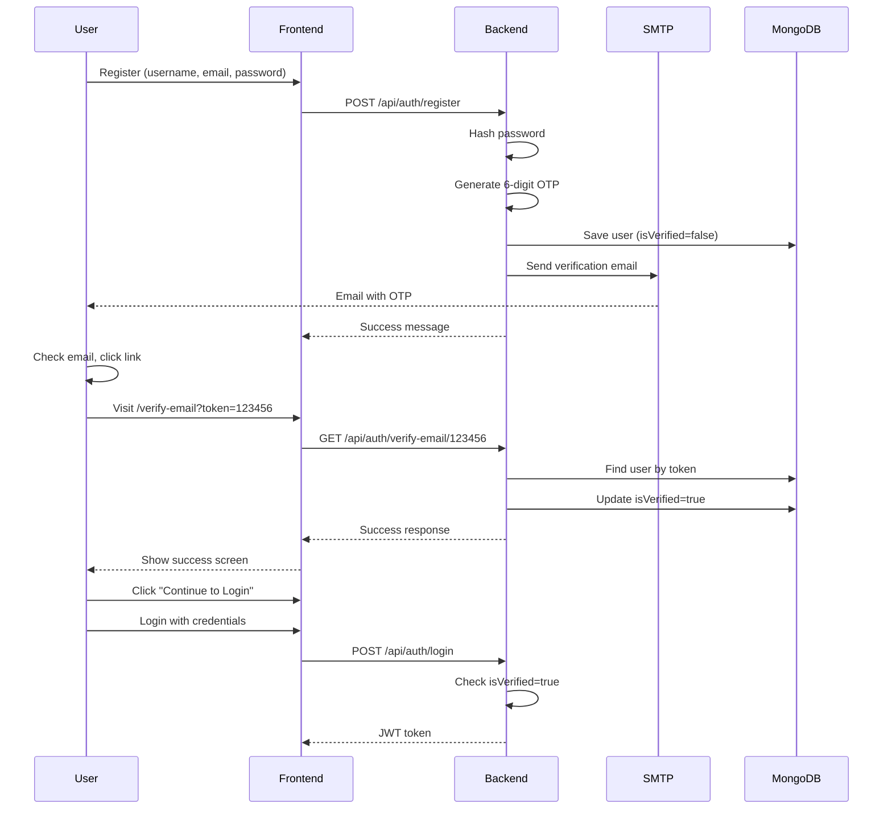

# Email Verification Flow - Documentation

## Overview

Hệ thống đã có **complete email verification flow** sử dụng 6-digit OTP gửi qua email khi user đăng ký.

## Flow Diagram



## API Endpoints

### 1. Register User
```http
POST /api/auth/register
Content-Type: application/json

{
  "username": "johndoe",
  "email": "john@example.com",
  "password": "password123"
}
```

**Response (201):**
```json
{
  "message": "User created successfully. Please check your email to verify account."
}
```

**Actions:**
- Generate 6-digit OTP (100000-999999)
- Save user với `isVerified: false`, `verificationToken: "123456"`
- Send email với verification link: `http://localhost:8080/verify-email?token=123456`

---

### 2. Verify Email
```http
GET /api/auth/verify-email/:token
```

**Example:**
```http
GET /api/auth/verify-email/123456
```

**Response (200):**
```json
{
  "success": true,
  "message": "Email verified successfully! You can now login."
}
```

**Error Responses:**

| Status | Message                                    |
| ------ | ------------------------------------------ |
| 400    | Verification token is required             |
| 400    | Invalid or expired verification token      |
| 400    | Email already verified. You can login now. |
| 500    | Server error                               |

---

### 3. Login (Enforces Verification)
```http
POST /api/auth/login
Content-Type: application/json

{
  "username": "johndoe",
  "password": "password123"
}
```

**Response nếu chưa verify (403):**
```json
{
  "message": "Please verify your email first. Check your inbox."
}
```

**Response nếu đã verify (200):**
```json
{
  "token": "eyJhbGciOiJIUzI1NiIsInR5cCI6IkpXVCJ9...",
  "user": {
    "id": "...",
    "username": "johndoe",
    "email": "john@example.com",
    "role": "user",
    "balance": 0
  }
}
```

---

## Email Configuration

### Environment Variables

**Backend (.env):**
```bash
# Gmail SMTP Configuration
EMAIL_USER=your-email@gmail.com
EMAIL_PASS=your-app-password  # NOT your Gmail password!

# Frontend URL (for verification link)
CLIENT_URL=http://localhost:8080
```

**Frontend (.env.local):**
```bash
# Backend API URL
VITE_API_URL=http://localhost:5000
```

### Gmail App Password Setup

1. Truy cập Google Account: https://myaccount.google.com/
2. Security → 2-Step Verification (bật nếu chưa có)
3. Security → App passwords
4. Tạo app password mới
5. Copy 16-character password vào `EMAIL_PASS`

**Lưu ý:** 
- **KHÔNG** dùng password Gmail thật
- App password format: `xxxx xxxx xxxx xxxx` (có spaces OK, code sẽ strip chúng)

---

## Email Template

**Subject:** Verify your R4B Account

**Body:**
```html
<h1>Welcome to R4B!</h1>
<p>Your verification code is:</p>
<h2 style="color: #06b6d4; font-size: 32px; letter-spacing: 5px;">
  123456
</h2>
<p>Enter this code on the website to verify your account.</p>
```

**Customization:**
Edit template tại `server/routes/auth.js` lines 74-79.

---

## Testing

### Manual Test (PowerShell)

```powershell
# 1. Register User
$body = @{
    username = "testuser123"
    email = "test@example.com"
    password = "password123"
} | ConvertTo-Json

Invoke-WebRequest `
    -Uri "http://localhost:5000/api/auth/register" `
    -Method POST `
    -Body $body `
    -ContentType "application/json"

# 2. Check console log for verification link
# Output: http://localhost:8080/verify-email?token=123456

# 3. Visit link in browser hoặc:
Invoke-WebRequest `
    -Uri "http://localhost:5000/api/auth/verify-email/123456" `
    -Method GET

# 4. Login
$loginBody = @{
    username = "testuser123"
    password = "password123"
} | ConvertTo-Json

Invoke-WebRequest `
    -Uri "http://localhost:5000/api/auth/login" `
    -Method POST `
    -Body $loginBody `
    -ContentType "application/json"
```

### Without Email (Development Mode)

Nếu `EMAIL_USER` và `EMAIL_PASS` không được set:
- Email **KHÔNG** được gửi
- Verification link được print ra console:
  ```
  ---------------------------------------------------
  NO SMTP CONFIGURED. VERIFICATION LINK:
  http://localhost:8080/verify-email?token=123456
  ---------------------------------------------------
  ```

---

## Troubleshooting

### 1. Email không được gửi

**Check:**
- `EMAIL_USER` và `EMAIL_PASS` có trong `.env`?
- App password đúng format?
- Console có error gì không?

**Debug:**
```javascript
// server/routes/auth.js line 82-88
transporter.sendMail(mailOptions, (err, info) => {
    if (err) {
        console.error('Error sending email:', err); // <-- Check this
    } else {
        console.log('Email sent:', info.response);
    }
});
```

### 2. "Invalid or expired verification token"

**Nguyên nhân:**
- User đã verify (token bị xóa)
- Token sai
- User bị delete từ DB

**Fix:**
Delete user và register lại:
```javascript
// MongoDB shell hoặc Compass
db.users.deleteOne({ email: "test@example.com" })
```

### 3. Frontend không connect được backend

**Check:**
- `VITE_API_URL` trong `.env.local`
- Backend có đang chạy không? (`http://localhost:5000`)
- CORS settings cho phép frontend origin?

**Fix CORS:**
```javascript
// server/index.js
app.use(cors({
  origin: ['http://localhost:5173', 'http://localhost:8080'],
  credentials: true
}));
```

### 4. TypeScript error: "Property 'env' does not exist"

**Fix:** File `src/vite-env.d.ts` đã được tạo với type definition:
```typescript
interface ImportMetaEnv {
  readonly VITE_API_URL: string
}
```

Restart TypeScript server (VS Code: `Ctrl+Shift+P` → "TypeScript: Restart TS Server")

---

## Security Notes

### ⚠️ Current Issues

1. **OTP không có expiration time**
   - Token valid mãi mãi cho đến khi user verify
   - **Đề xuất:** Add `verificationTokenExpires` field

2. **OTP có thể bị brute-force**
   - Chỉ 6 digits = 1 triệu combinations
   - Không có rate limiting cho verify endpoint
   - **Đề xuất:** Add rate limit (5 attempts/15 minutes)

3. **Email verification bắt buộc**
   - User không thể login nếu không verify
   - Admin cần manual intervention nếu email không tới
   - **Đề xuất:** Add admin endpoint để force verify user

### 🔒 Recommendations

```javascript
// 1. Add expiration (15 phút)
const verificationToken = Math.floor(100000 + Math.random() * 900000).toString();
const verificationTokenExpires = new Date(Date.now() + 15 * 60 * 1000);

// 2. Check expiration
if (user.verificationTokenExpires < Date.now()) {
  return res.status(400).json({ message: 'Verification token expired. Please register again.' });
}

// 3. Rate limiting
const rateLimit = require('express-rate-limit');
const verifyLimiter = rateLimit({
  windowMs: 15 * 60 * 1000, // 15 minutes
  max: 5 // 5 attempts
});
router.get('/verify-email/:token', verifyLimiter, async (req, res) => { ... });
```

---

## Production Checklist

- [ ] Update `CLIENT_URL` trong `.env.production` (https://your-domain.com)
- [ ] Update `VITE_API_URL` trong build config
- [ ] Verify Gmail App Password works
- [ ] Test email delivery (không bị spam folder)
- [ ] Add token expiration logic
- [ ] Add rate limiting
- [ ] Monitor email send failures (add to SystemLog)
- [ ] Setup email retry queue (Bull/Agenda)

---

*Documentation created: 2026-01-25*
