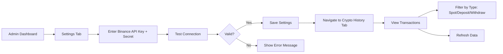

# Binance Crypto Transaction History Integration - Walkthrough

Đã hoàn thành tích hợp Binance API để theo dõi lịch sử giao dịch crypto trong Admin Dashboard theo pattern TPBank.

---

## 🎯 What Was Built

### Backend Components

#### [server/utils/binance.js](file:///c:/Users/Adonis/Downloads/App/server/utils/binance.js)

Binance client wrapper với các methods:

- `getSpotTransactionHistory(apiKey, secretKey, options)` - Lấy lịch sử trading spot (BUY/SELL)
- `getDepositHistory(apiKey, secretKey, options)` - Lấy lịch sử deposit
- `getWithdrawHistory(apiKey, secretKey, options)` - Lấy lịch sử withdrawal
- `getAllHistory(apiKey, secretKey, options)` - Combined tất cả loại transactions
- `testConnection(apiKey, secretKey)` - Test API credentials

**Features:**
- Error handling với Binance-specific error codes
- Data formatting thống nhất cho frontend
- Support filtering theo symbol, time range, transaction type

#### [server/models/Settings.js](file:///c:/Users/Adonis/Downloads/App/server/models/Settings.js)

Đã thêm `binance` schema:

```js
binance: {
    apiKey: { type: String, default: '' },
    secretKey: { type: String, default: '' }
}
```

#### [server/routes/settings.js](file:///c:/Users/Adonis/Downloads/App/server/routes/settings.js)

Thêm 2 endpoints mới:

**1. Test Connection**
```
POST /api/settings/test-binance
Body: { apiKey, secretKey }
Response: { success: true, message: "...", canTrade, canWithdraw, balances }
```

**2. Fetch History**
```
POST /api/settings/binance-history
Body: { type: "spot" | "deposit" | "withdraw", symbol?, limit?, startTime?, endTime? }
Response: Array of transactions hoặc { spot: [], deposits: [], withdrawals: [], combined: [] }
```

---

### Frontend Components

#### [src/components/admin/BinanceMonitor.tsx](file:///c:/Users/Adonis/Downloads/App/src/components/admin/BinanceMonitor.tsx)

Component chính để monitor Binance transactions với 2 tabs:

**Dashboard Tab:**
- 3 stat cards: Total Transactions, Total Volume (USDT), Latest Activity
- Recent Transactions table với filters (All/Spot/Deposit/Withdraw)
- Real-time refresh button
- Responsive design với Liquid Glass effects

**Raw Data Tab:**
- Filter buttons (All/Spot/Deposit/Withdraw)
- JSON view của raw data từ Binance API
- Fullscreen scrollable display

**UI Highlights:**
- Cream Cyan brand color (#5ff5ff)
- Amber/Bitcoin theme cho crypto (amber-500, amber-400)
- Badge colors: Blue (Spot), Green (Deposit), Rose (Withdraw)
- Glassmorphism effects
- Professional charts-ready layout

#### [src/pages/AdminDashboard.tsx](file:///c:/Users/Adonis/Downloads/App/src/pages/AdminDashboard.tsx)

**Integration Changes:**

1. **New Tab:** "Crypto History" với Wallet icon
2. **Component Import:** `BinanceMonitor`
3. **Settings UI:** Binance API Configuration section với:
   - API Key input
   - Secret Key input (password type)
   - Test Connection button
   - Status feedback (success/error messages)
   - Link to Binance API Management

---

## 📊 How It Works

### Admin Flow



### Data Flow

1. **Settings Save:** Admin nhập API credentials → Save to MongoDB
2. **Fetch History:** 
   - Frontend gọi `POST /api/settings/binance-history`
   - Backend lấy credentials từ Settings
   - Call Binance API với `binance.js` client
   - Format data và return to frontend
3. **Display:** BinanceMonitor render transactions với filters

---

## ✅ Verification Steps

> [!IMPORTANT]
> **Để test integration này, bạn cần Binance API Key:**

### 1. Tạo Binance API Key

1. Truy cập [Binance API Management](https://www.binance.com/en/my/settings/api-management)
2. Click "Create API"
3. **QUAN TRỌNG:** Chỉ enable **"Enable Reading"** permission
4. (Optional) Whitelist IP nếu muốn bảo mật cao hơn
5. Copy API Key và Secret Key

### 2. Configure trong App

1. Login vào Admin Dashboard
2. Navigate to **Settings** tab
3. Scroll xuống "Binance API Configuration"
4. Paste **API Key** và **Secret Key**
5. Click **"Test Connection"**
6. Xem feedback:
   - ✅ Success: "Connection successful! Can trade: true/false..."
   - ❌ Error: Error message cụ thể (invalid key, wrong permissions, etc.)
7. Click **"Save Changes"** (top right)

### 3. View Transaction History

1. Navigate to **"Crypto History"** tab (sidebar)
2. Dashboard hiển thị:
   - Total Transactions count
   - Total Volume (trading volume in USDT)
   - Latest Activity timestamp
3. Recent Transactions table:
   - Filter by transaction type (dropdown)
   - View: Time, Type, Symbol/Coin, Amount, Side/Status
4. Switch to **"Raw Data"** tab:
   - Filter buttons: All, Spot, Deposit, Withdraw
   - JSON raw data view
5. Click **Refresh** để fetch latest data

### 4. Error Handling Test

**Test Case 1: Invalid Credentials**
- Settings → Nhập sai API key → Test Connection → Should show error

**Test Case 2: No Credentials**
- Crypto History tab → Mà chưa save credentials → Should show alert hoặc empty state

**Test Case 3: No Transactions**
- Fresh Binance account → Should show "No transactions found"

---

## 🔧 Technical Notes

### Dependencies

```json
{
  "binance": "^latest"
}
```

Installed via: `npm install binance`

### Security Considerations

> [!WARNING]
> **Secret Key Storage:**
> - Currently lưu plaintext trong MongoDB (giống TPBank password)
> - Recommend: Use IP Whitelist + READ-ONLY permissions
> - Future improvement: Encrypt credentials với `crypto` module

### API Rate Limits

Binance API có rate limits:
- Weight limit: 1200/minute
- Order limit: 100/10s

Client tự động handle rate limit errors (status 429).

### Performance

- Frontend: Fetch on-demand (manual refresh hoặc tab change)
- No auto-polling (tránh spam API)
- Data cached in component state (re-fetch khi filter change)

---

## 📝 Next Steps (Optional Enhancements)

- [ ] Auto-refresh toggle (giống TPBank worker)
- [ ] Export transactions to CSV
- [ ] Charts: Volume trend, Top trading pairs
- [ ] Webhook integration cho real-time updates
- [ ] Multi-account support (nhiều Binance accounts)

---

## 🎉 Summary

**Status:** ✅ **Fully Implemented**

**What Works:**
- ✅ Backend API integration với Binance
- ✅ Settings UI để configure credentials
- ✅ Test connection functionality
- ✅ Crypto History tab với Dashboard + Raw Data views
- ✅ Transaction filtering by type
- ✅ Responsive UI theo Liquid Glass theme

**Ready for Testing:** Cần Binance API Key để verify end-to-end flow
